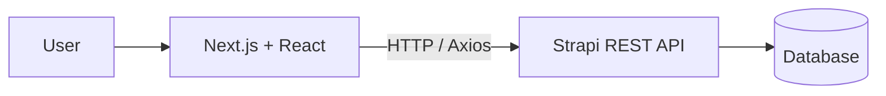

# YSF Merchandise Ordering

An early full-stack university project built with **Next.js, React, and Strapi** for collecting merchandise orders through a simple web interface.

> **Archive note:** Built around my early university semesters as a learning project for frontend-to-REST-API integration, form handling, and persistent order data.

## Overview

The system is split into two repositories:

```text
Next.js Frontend
      ↓
 Strapi REST API
      ↓
   Database
```

The frontend collects merchandise-order information and communicates with Strapi through HTTP requests.

## Features

- Merchandise order form
- Customer name, email, and telephone
- Group / `sel` selection
- Shirt size selection
- Quantity input
- Pickup-location selection
- Submit orders through the Strapi REST API
- Retrieve stored orders
- Paginated order list
- Loading and error states
- Responsive UI

## Architecture



## Order Data

The Strapi `Order` collection stores fields such as:

```text
fullName
email
telephone
sel
size
quantity
tempatPengambilan
```

The backend schema also includes validation for required fields, email format, telephone values, and allowed pickup locations.

## Tech Stack

### Frontend

- Next.js 15
- React 19
- TypeScript
- Axios
- Tailwind CSS
- Radix UI / shadcn-style components

### Backend

- Strapi 5
- REST API
- Database persistence

## What I Learned

This project was an early introduction to:

- connecting a React/Next.js frontend to an external backend;
- consuming REST APIs with Axios;
- submitting form data through HTTP;
- retrieving and paginating persisted records;
- using a headless CMS as an application backend;
- separating frontend and backend responsibilities.

It became an early step toward the more custom backend and infrastructure work I built in later projects.

## Limitations

This is an archived learning project.

The current implementation includes several prototype-level choices, including:

- hard-coded local API URLs;
- unfinished authentication UI;
- some debugging output in the interface;
- minimal custom backend business logic beyond the Strapi data model.

## Status

**Archived / early university project**

Preserved as part of my progression from simple frontend/backend integration toward larger full-stack and systems projects.

## Author

Built by [MoricCosmo](https://github.com/MoricCosmo).
